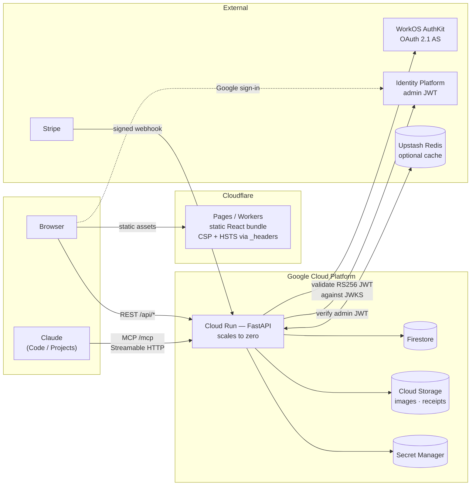

# MadeForSeconds

A personal recipe site with supporter subscriptions, a TOTP-gated expense ledger, and a remote MCP server that lets Claude author and publish recipes over OAuth 2.1 — built to run almost entirely on GCP's free tier, with a small, monitored, budget-capped spend for cost-safety and secret-hygiene automation.

[](https://github.com/kevin-tran12/MadeForSeconds/actions/workflows/ci.yml)
[](LICENSE)

## Stack

| Layer | Technology |
|-------|------------|
| Frontend | React 19 + Vite 8 + TypeScript + Tailwind CSS v4 |
| Backend | FastAPI (Python 3.12) |
| Database | Cloud Firestore |
| Auth | Google Identity Platform (Firebase) |
| Admin 2FA | TOTP (pyotp) gating the expense ledger |
| Payments | Stripe (one-time and recurring donations) |
| Email | Resend |
| Agent interface | Remote MCP server (Streamable HTTP), OAuth 2.1 via WorkOS AuthKit |
| Reader assistant | "Sous Chef" — Claude Sonnet 5 answers over SSE, Claude Haiku 4.5 topic gate, hard monthly spend cap in Redis |
| Caching | Upstash Redis (optional, falls back to in-memory) |
| Backend hosting | GCP Cloud Run (scale to zero) |
| Frontend hosting | Cloudflare Pages |
| DNS / CDN | Cloudflare |
| CI/CD | GitHub Actions (build, staging/production apply + deploy) + Cloudflare Pages (frontend) |
| Infrastructure | Terraform |
| Observability | Cloud Monitoring alert policies (uptime, error rate, 5xx) + weekly usage email, budget-capped infra |

Every GCP service stays within, or just barely above, the always-free tier for personal/low-traffic use. Public request traffic — the dominant cost driver — is auto-cut off if actual spend crosses $15/month; a handful of small always-on lines (storage, Firestore, egress) are not capped by that mechanism but run to cents at this scale (see [docs/DEPLOYMENT.md § Cost circuit breaker](docs/DEPLOYMENT.md#cost-circuit-breaker) and [§ GCP free tier summary](docs/DEPLOYMENT.md#gcp-free-tier-summary)).

> **First-time production setup?** See [docs/DEPLOYMENT.md](docs/DEPLOYMENT.md).

---

## Architecture



The browser never touches Firestore. Every read and write goes through FastAPI, which is the only component holding credentials. Three independent auth paths converge on it: Identity Platform JWTs for the admin UI, WorkOS-issued OAuth tokens for MCP clients, and Google-signed OIDC tokens for scheduled internal jobs.

---

## Features

### Public
- Browse, search, and filter recipes by category or ingredient
- Full recipe detail with cooking mode (full-screen step-by-step), nutrition, and multi-component dishes
- RSS feed and XML sitemap
- Supporter wall with optional display name and note

### Admin
- Create, edit, and delete recipes with rich structured fields (ingredients, instructions, components, nutrition)
- Upload recipe images to Cloud Storage
- Manage subscriber and donor display names/notes (approve, reject, toggle visibility)
- Expense ledger (TOTP 2FA protected): create, edit, void expenses with receipt uploads
- Expense reports: monthly/yearly summaries by category, CSV and PDF export

### Donations
- Stripe Checkout for one-time and recurring donations
- Post-payment profile setup (display name + note, subject to admin approval)
- Self-service cancellation via signed email link

### Sous Chef (reader assistant)
- Ask questions about the recipe on the page: substitutions, timing, technique, scaling, and what else on the site uses an ingredient
- Grounded in the recipe, the owner's private per-recipe notes, and a compact catalogue index; a professional-chef persona that pitches each answer to the reader's saved cooking experience
- Hard-coded food-safety temperatures, refusals for canning/curing/infant food, an allergen disclaimer, a Haiku topic gate that refuses anything off-topic before the main model runs, and a rules-leak check
- Google sign-in required; 5 questions/day free, 50/day + 400/month for supporters; a $10/month spend cap that fails closed without Redis
- Thumbs up/down feedback (hashed reader, 180-day TTL) surfaces in the admin dashboard

### Agent interface (MCP)
- Author, revise, and publish recipes from a Claude conversation — no admin UI needed
- OAuth 2.1 with PKCE and dynamic client registration; no static API key anywhere

---

## MCP server

The backend doubles as a remote [Model Context Protocol](https://modelcontextprotocol.io) server mounted at `/mcp`, so recipes can be written and published from a Claude conversation. Built on the `mcp` Python SDK 2.x (`MCPServer`); clients on the older `initialize` handshake still connect.

### Auth model

The interesting part is that **the MCP server holds no credentials of its own.** It is an OAuth 2.1 *resource server*; [WorkOS AuthKit](https://www.authkit.com/) is the authorization server and owns login, consent, PKCE, and dynamic client registration.

```
Claude ──── 1. GET /mcp (no token) ─────────────►  FastAPI
       ◄─── 401 + WWW-Authenticate ──────────────
            (points at protected-resource metadata)

Claude ──── 2. discover + register + PKCE ──────►  WorkOS AuthKit
       ◄─── 3. access token (RS256 JWT) ─────────

Claude ──── 4. GET /mcp + Bearer token ─────────►  FastAPI
                                                   ├─ fetch JWKS (cached)
                                                   ├─ verify RS256 signature
                                                   ├─ check issuer, exp, audience
                                                   └─ owner identity (sub or email)
```

Verification lives in [`backend/app/mcp_auth.py`](backend/app/mcp_auth.py). It pins `algorithms=["RS256"]`, so `alg: none` and symmetric-key confusion attacks are both rejected, then binds the token to this resource and this owner with three checks beyond signature and issuer: **audience** (`MCP_ENFORCE_AUDIENCE`, on by default, checked against `MCP_RESOURCE_URL`), **owner identity** (an admin email in `ADMIN_EMAILS` or an immutable WorkOS `sub` in `MCP_OWNER_SUBJECT` — no fallback), and **scopes** (optional, `MCP_REQUIRED_SCOPES`, enforced by the SDK itself).

Local dev runs the MCP server unauthenticated, mirroring the `require_admin` dev bypass — there is no WorkOS dependency to stand up just to work on tools.

### Tools

| Tool | Purpose |
|------|---------|
| `list_categories` | Allowed category list |
| `list_recipes` | Search/filter existing recipes before creating |
| `get_recipe` | Full recipe by id or slug |
| `create_recipe` | Save a draft — duplicate titles return a pointer to the existing recipe instead of writing a second one |
| `update_recipe` | Revise a draft (array fields are replaced whole) |
| `request_image_upload` | Signed PUT URL for direct-to-GCS upload |
| `upload_image_from_url` | Server-side fetch of an already-hosted image, with SSRF guards |
| `publish_recipe` / `unpublish_recipe` | Toggle visibility; publish refuses incomplete recipes |
| `delete_recipe` | Requires the title as confirmation |
| `create_expense` | Add a ledger entry with an attached receipt |
| `publish_instagram_post` | Post an already-hosted public HTTPS image to Instagram, with a caption |
| `publish_recipe_to_instagram` | Post a recipe's own image, auto-building a caption from its title/description/link/hashtags |
| `get_social_kit` | Recipe summary + brand voice + hashtag tiers + platform limits so the MCP client drafts Instagram/TikTok posts consistently (no server-side LLM) |
| `social_status` | Per-platform token health from the twice-monthly refresh job |
| `list_ingredients` | Every distinct ingredient across the catalogue, with recipe counts and profile coverage — start here for an authoring session |
| `get_ingredient` | Fetch a profile by slug or by resolving a name/alias |
| `upsert_ingredient` | Create or update a profile (safe to retry — the slug is the key) |
| `delete_ingredient` | Remove a profile from the knowledge base |

Typical flow: `list_categories` → `create_recipe` (draft) → `update_recipe` to iterate → `request_image_upload` + `update_recipe(image_url=…)` → `publish_recipe`. Ingredient knowledge: `list_ingredients(coverage="missing")` → draft profiles in the owner's voice → `upsert_ingredient` once approved.

> The backend scales to zero, so the first call after an idle period takes ~10s.

---

## Project structure

```
├── backend/                    FastAPI application
│   ├── app/
│   │   ├── main.py             Entry point, CORS, routers, cache warm-up
│   │   ├── auth.py             Identity Platform JWT verification
│   │   ├── subscriber_auth.py  JWT generation for cancel links
│   │   ├── firestore.py        Firestore client singleton
│   │   ├── cache.py            Redis / in-memory caching
│   │   ├── config.py           Settings + env var loading
│   │   ├── models.py           Pydantic schemas (Recipe, Ingredient, Instruction…)
│   │   ├── models_expense.py   Pydantic schemas (Expense, ExpenseItem…)
│   │   ├── totp.py             TOTP 2FA logic and session JWT
│   │   ├── validation.py       Shared validators (admin routes + MCP)
│   │   ├── mcp_server/         MCP server package
│   │   │   ├── server.py       MCPServer construction, auth/transport settings, instructions
│   │   │   ├── tools/          One module per tool domain — recipes, ingredients, images, social, expenses —
│   │   │   │                   each exposing a TOOLS tuple and a register(mcp) function
│   │   │   └── errors.py       tool_errors: domain errors → structured dicts
│   │   ├── mcp_auth.py         WorkOS OAuth token verification (resource server)
│   │   ├── services/
│   │   │   ├── recipes.py      Recipe domain logic shared by routes and MCP
│   │   │   └── uploads.py      GCS upload, signed URLs, content sniffing
│   │   └── routes/
│   │       ├── public.py       GET /api/recipes, /categories, /sitemap.xml, /feed.xml
│   │       ├── admin.py        Admin recipe CRUD, image upload, supporter moderation
│   │       ├── subscriptions.py Stripe checkout, webhooks, cancel flow
│   │       ├── internal.py     Scheduler-invoked jobs (Google OIDC gated)
│   │       ├── expenses.py     Expense CRUD + receipt upload (TOTP-gated)
│   │       ├── reports.py      Expense summaries, CSV/PDF export (TOTP-gated)
│   │       └── totp.py         TOTP setup, verify, session endpoints
│   ├── tests/                  Pytest suite (938 tests across 40 files)
│   ├── seed.py                 Load sample recipes into Firestore emulator
│   ├── Dockerfile              Production container
│   └── requirements.txt
├── src/                        React frontend
│   ├── lib/
│   │   ├── api-client.ts       Fetch wrapper (auth + TOTP header injection)
│   │   ├── api.ts              All API functions (public + admin)
│   │   ├── auth.ts             Firebase Identity Platform init
│   │   ├── types.ts            Recipe TypeScript interfaces
│   │   └── types-expense.ts    Expense TypeScript interfaces
│   ├── hooks/                  useRecipes, useRecipe, useCategories, useAuth
│   ├── contexts/               AuthContext (dev + prod auth modes)
│   ├── components/             UI, recipe, layout, admin, search, SEO components
│   └── pages/                  Route page components
├── tests-e2e/                  Playwright E2E tests (6 spec files)
├── terraform/                  GCP infrastructure as code
│   ├── modules/
│   │   ├── security/           Backend SA, Secret Manager, Identity Platform
│   │   ├── storage/             Images + receipts buckets, Firestore
│   │   ├── backend-service/     Cloud Run, Artifact Registry, scheduler
│   │   ├── observability/       Uptime check, error/5xx log metrics + alerts
│   │   └── cost-controls/       Budget, breaker Cloud Functions, breaker-reset job
│   └── *.tf                    Providers, variables, shared root-level resources
├── public/
│   ├── _headers                CSP + security headers served by Cloudflare
│   └── _redirects              sitemap/feed proxying to the backend
├── docs/
│   └── DEPLOYMENT.md           Full production setup guide
├── .github/workflows/ci.yml    Security scan, tests, terraform, build gate
├── vitest.config.ts            Frontend unit test config
├── playwright.config.ts        E2E test config
├── docker-compose.yml          Local dev stack
└── .env.local.example          Local env var template
```

---

## Local development

### Prerequisites

- [Docker Desktop](https://www.docker.com/products/docker-desktop/)
- [Node.js 22+](https://nodejs.org/)

### Steps

**1. Clone and enter the repo**
```bash
git clone https://github.com/YOUR_USERNAME/MadeForSeconds.git
cd MadeForSeconds
```

**2. Set up environment variables**
```bash
cp .env.local.example .env.local
```
Edit `.env.local` and set at minimum:
- `VITE_DEV_ADMIN_PASSWORD` — any string, used as your local admin password

Optional (needed for full local feature testing):
- `STRIPE_SECRET_KEY`, `STRIPE_WEBHOOK_SECRET` — Stripe test keys
- `STRIPE_PRODUCT_ID` — (Optional) Legacy Stripe Product ID
- `SUBSCRIBER_JWT_SECRET` — any 32+ character string

**3. Start all services**
```bash
docker compose --env-file .env.local up
```
`--env-file .env.local` is required, not optional — Compose's own variable interpolation (the
`${STRIPE_SECRET_KEY}`-style references in `docker-compose.yml`'s `backend` service) only reads a
file literally named `.env` by default. Without the flag, `STRIPE_SECRET_KEY`,
`STRIPE_WEBHOOK_SECRET`, and `SUBSCRIBER_JWT_SECRET` silently resolve to their empty/default
fallbacks in the backend container even when they're set in `.env.local` — the frontend container
picks them up fine either way via its own `env_file:` directive, which masked this for a while.

| Service | URL | Purpose |
|---------|-----|---------|
| Firestore emulator | `http://localhost:8080` | Local Firestore |
| FastAPI backend | `http://localhost:8000` | Recipe + admin API |
| Vite frontend | `http://localhost:5173` | React app |

**4. Seed sample recipes** (first time only)
```bash
docker compose exec backend python seed.py
```

**5. Open the app**

Go to `http://localhost:5173`. To access the admin panel:
1. Click **Admin login** in the header
2. Enter the password you set in `VITE_DEV_ADMIN_PASSWORD`

### Useful dev commands

```bash
docker compose logs -f backend          # Tail backend logs
docker compose restart backend          # Reload after Python changes
docker compose exec backend bash        # Shell into backend container
docker compose down                     # Stop everything

npm run build                           # TypeScript check + Vite build
npm run test:unit                       # Vitest unit tests
npm run test:backend                    # Pytest (938 tests)
npm run test:e2e                        # Playwright E2E (requires running stack)
npm run test:e2e:ui                     # Playwright with interactive UI
```

### Local Stripe testing

```bash
brew install stripe/stripe-cli/stripe   # macOS
winget install --id Stripe.StripeCli -e # Windows
stripe login
stripe listen --forward-to localhost:8000/api/subscribe/webhook
# Copy the webhook signing secret it prints → set as STRIPE_WEBHOOK_SECRET in .env.local,
# and set STRIPE_SECRET_KEY there too (a real sk_test_... key from the Stripe dashboard).
# Restart the backend afterward: docker compose restart backend
```

---

## API routes

### Public (no auth required)

| Method | Path | Description |
|--------|------|-------------|
| GET | `/api/health` | Health / liveness check |
| GET | `/api/recipes` | List published recipes (`?search=`, `?category=`, `?label=`, `?search_by=`, `?limit=`, `?cursor=`) |
| GET | `/api/recipes/grouped` | Homepage payload — recent recipes plus per-category groups |
| GET | `/api/recipes/{slug}` | Single recipe |
| GET | `/api/categories` | All unique categories |
| GET | `/api/pages/{page_id}` | Editable page copy (home, about) |
| GET | `/api/sitemap.xml` | SEO sitemap |
| GET | `/api/feed.xml` | RSS feed |
| GET | `/api/subscribe/supporters` | Public supporter list |

### Admin — recipes (requires auth)

| Method | Path | Description |
|--------|------|-------------|
| GET | `/api/admin/recipes` | All recipes (including drafts) |
| POST | `/api/admin/recipes` | Create recipe (slug auto-generated) |
| PUT | `/api/admin/recipes/{id}` | Update recipe |
| DELETE | `/api/admin/recipes/{id}` | Delete recipe |
| POST | `/api/admin/upload-image` | Upload recipe image to GCS (magic-byte validated) |
| POST | `/api/admin/upload-receipt` | Upload a recipe purchase receipt (image or PDF) |
| DELETE | `/api/admin/recipes/{id}/receipts` | Detach a receipt from a recipe |
| GET | `/api/admin/categories` | Allowed category list |
| PUT | `/api/admin/categories` | Replace the allowed category list |
| GET | `/api/admin/pages/{page_id}` | Read editable page copy |
| PUT | `/api/admin/pages/{page_id}` | Update editable page copy |

### Admin — supporters (requires auth)

| Method | Path | Description |
|--------|------|-------------|
| GET | `/api/admin/supporters/pending` | Pending name/note approvals |
| GET | `/api/admin/supporters/all` | All supporters |
| POST | `/api/admin/supporters/{collection}/{id}/approve-note` | Approve note |
| POST | `/api/admin/supporters/{collection}/{id}/reject-note` | Reject note |
| POST | `/api/admin/supporters/{collection}/{id}/toggle-note` | Toggle note visibility |
| POST | `/api/admin/supporters/{collection}/{id}/toggle-name` | Toggle name visibility |

### Admin — Sous Chef (requires auth)

| Method | Path | Description |
|--------|------|-------------|
| GET | `/api/admin/assistant/feedback` | Newest reader feedback, thumbs-down first (`?limit=`) |
| GET | `/api/admin/ingredients/coverage` | Ingredients used across published recipes, with profile coverage, sorted by recipe count |
| GET | `/api/admin/ingredients` | Every ingredient profile |
| GET | `/api/admin/ingredients/{slug}` | One ingredient profile |
| PUT | `/api/admin/ingredients/{slug}` | Create (201) or update (200) an ingredient profile |
| DELETE | `/api/admin/ingredients/{slug}` | Delete an ingredient profile |

### Admin — expenses (requires auth + TOTP session)

| Method | Path | Description |
|--------|------|-------------|
| POST | `/api/admin/expenses` | Create expense |
| GET | `/api/admin/expenses` | List expenses (`?year=`, `?month=`, `?category=`) |
| GET | `/api/admin/expenses/{id}` | Get expense |
| PUT | `/api/admin/expenses/{id}` | Update expense |
| POST | `/api/admin/expenses/{id}/void` | Void expense (`?reason=`) — ledger entries are never deleted |
| POST | `/api/admin/expenses/upload-receipt` | Upload a receipt to the private GCS bucket |
| GET | `/api/admin/expenses/{id}/receipt` | Time-limited signed URL for a stored receipt |

### Admin — reports (requires auth + TOTP session)

| Method | Path | Description |
|--------|------|-------------|
| GET | `/api/admin/reports/summary` | Expense totals by category (`?year=`, `?month=`) |
| GET | `/api/admin/reports/export/csv` | CSV export |
| GET | `/api/admin/reports/export/pdf` | PDF export |

### Admin — TOTP (requires auth)

| Method | Path | Description |
|--------|------|-------------|
| GET | `/api/admin/totp/status` | Check if TOTP is configured |
| POST | `/api/admin/totp/setup` | Generate secret + QR code |
| POST | `/api/admin/totp/confirm-setup` | Verify code and save config |
| POST | `/api/admin/totp/verify` | Verify code and get session token |
| POST | `/api/admin/totp/reset` | Clear TOTP config |

### Reader (requires Google sign-in)

| Method | Path | Description |
|--------|------|-------------|
| GET | `/api/me` | Profile: email, admin flag, supporter status, returning flag, cooking experience, current Sous Chef allowance |
| PUT | `/api/me/experience` | Save cooking experience (`level`, `notes`) — the assistant pitches answers to it |
| DELETE | `/api/me/data` | Delete-my-data: reader record, feedback, supporter uid links |
| GET | `/api/assistant/status` | Public: configured / paused / quotas / levels |
| POST | `/api/assistant/ask` | Server-Sent Events: `meta`, `delta`…, `done` \| `error`. Rate limited, quota-gated, spend-capped |
| POST | `/api/assistant/feedback` | Thumbs up/down on an answer |

### Subscriptions

| Method | Path | Description |
|--------|------|-------------|
| POST | `/api/subscribe/checkout` | Create Stripe Checkout session (Donation) |
| POST | `/api/subscribe/webhook` | Stripe webhook receiver |
| GET | `/api/subscribe/session-info` | Info for completed donation |
| POST | `/api/subscribe/setup-profile` | Set display name/note after donation |
| POST | `/api/subscribe/cancel-request` | Request recurring donation cancellation (sends email) |
| POST | `/api/subscribe/cancel-confirm` | Confirm cancellation with token |

### Agent (OAuth 2.1 — WorkOS-issued token, admin-gated)

| Method | Path | Description |
|--------|------|-------------|
| POST | `/mcp` | MCP endpoint (Streamable HTTP). Unauthenticated calls get a 401 plus a `WWW-Authenticate` challenge pointing at the metadata URL below |
| GET | `/.well-known/oauth-protected-resource/mcp` | RFC 9728 resource metadata, served by the MCP SDK. The `/mcp` suffix is part of the path — the bare `/.well-known/oauth-protected-resource` is a 404. Only served in production, since dev runs the MCP server unauthenticated |

---

## Testing

The project has three test layers.

### Backend — pytest (938 tests, 40 files)
```bash
npm run test:backend
# or: cd backend && pytest --cov=app --cov-report=term-missing
```
Covers: auth, MCP token verification, models, cache, public routes, admin routes, upload sniffing and sanitisation, supporter moderation, subscriptions, expenses, reports, TOTP, internal OIDC-gated routes, social token rotation, log redaction, Cloud Trace export.

### Frontend unit — vitest (143 tests, 22 files)
```bash
npm run test:unit
```
Covers: API client, expense math, hooks (useRecipes, useRecipe, useCategories), UI components, support and donation-link pages, auth context and admin route gating, the Sous Chef drawer, hook, clarifying-question form, SSE parser, streaming client, and the admin ingredient-profiles panel.

### E2E — Playwright (6 spec files)
```bash
npm run test:e2e             # headless
npm run test:e2e:ui          # interactive
```
Covers: home page, public recipe browsing, recipe detail, admin recipe CRUD, navigation, support page.

Set `PLAYWRIGHT_TEST_BASE_URL` to run the same suite against a real deployed
target instead of a local dev server — e.g. staging:
```bash
PLAYWRIGHT_TEST_BASE_URL=https://staging.madeforseconds.pages.dev npx playwright test --project=chromium
```
When set, `playwright.config.ts` skips starting a local `npm run dev` server
entirely (it would only ever bind to localhost, never the remote target).

---

## CI/CD

[`.github/workflows/ci.yml`](.github/workflows/ci.yml) runs on every PR and every push to `main`:

| Job | What it does |
|-----|--------------|
| **Security Scan** | gitleaks over full git history · bandit SAST · pip-audit · `npm audit` on production deps |
| **Backend Tests** | pytest with coverage |
| **Frontend Tests** | vitest |
| **E2E Tests** | Playwright (chromium) against a real Firestore emulator + backend, via `docker compose` |
| **Terraform Validate** | `terraform fmt -check`, `terraform validate`, `terraform test` (mocked providers), plus pytest for both Cloud Functions (budget breaker, secret pruner) |
| **Inventory Check** | `scripts/check_inventory.py` — README's test counts, file counts, and toolchain versions cross-checked against the actual manifests and test runs; fails the build on drift |
| **Build Check** | `tsc -b && vite build` — gated on all six jobs above |

`main` is protected: a PR cannot merge until every one of these passes and the branch is up to date with `main`. Force pushes and branch deletion are blocked.

Python dependencies carry upper version bounds on purpose. Because CI gates merges, an upstream major release must never be able to turn the build red on its own.

[`.github/workflows/deploy.yml`](.github/workflows/deploy.yml) runs after a merge lands on `main` — the actual promotion pipeline: build the backend image once, apply + deploy + seed + full-E2E it against staging, and only then apply + deploy the same image to production. See `docs/DEPLOYMENT.md` § Merge-to-main promotion pipeline for the required secrets and the full stage breakdown.

### Toolchain versions

Kept in sync with the actual manifests by `scripts/check_inventory.py`, run in CI on every push —
a mismatch fails the build rather than drifting silently (which is how the test counts above went
stale for months). Regenerate this table with the same script (`--fix`) rather than hand-editing it.

| Component | Version | Source of truth |
|---|---|---|
| Terraform CLI | 1.15.9 | `terraform/main.tf` (`required_version`) |
| `google` / `google-beta` provider | 6.50.0 | `terraform/.terraform.lock.hcl` |
| Playwright | 1.62.1 | `package.json` |
| Backend base image | `python:3.12-slim` | `backend/Dockerfile` |
| GitHub Actions | `actions/attest-build-provenance@v3`, `actions/checkout@v7`, `actions/setup-node@v7`, `actions/setup-python@v7`, `actions/upload-artifact@v4`, `google-github-actions/auth@v2`, `hashicorp/setup-terraform@v4` | `.github/workflows/*.yml` |

---

## Caching

Read-heavy public endpoints (`/api/recipes`, `/api/recipes/grouped`, `/api/categories`) are cached in [`backend/app/cache.py`](backend/app/cache.py). Two backends, chosen at startup:

| `REDIS_URL` | Backend | Behaviour |
|---|---|---|
| set and reachable | `RedisCache` | Shared across instances, survives cold starts |
| set but unreachable | `MemoryCache` | Logs a **warning**, degrades rather than failing requests |
| unset | `MemoryCache` | Per-instance, expected locally and in CI |

Invalidation is explicit: admin mutations call `cache.clear()`, which bumps a version counter in Redis so all previous keys become unreachable in O(1) — no `KEYS`/`SCAN` on every write. The 24-hour TTL is only a safety net for a day of total inactivity.

`_warm_cache()` in [`main.py`](backend/app/main.py) pre-populates the homepage and recipe-list responses at startup so the first request after a Cloud Run cold start is fast.

### Why Redis matters here specifically

Cloud Run **scales to zero**. With `MemoryCache`, every cold start begins with an empty cache and nothing is shared between concurrent instances, so the cache stops doing most of its job. Redis is what makes it survive.

### Setting it up

Use [Upstash](https://upstash.com) (free tier, no VPC needed) and put the URL in `terraform.tfvars` as `redis_url`. Terraform stores it in Secret Manager and injects it into Cloud Run only when non-empty.

> **Use the `rediss://` endpoint, not `redis://`.** Upstash is reached over the public internet; the `redis://` scheme sends the auth token and every cached value in cleartext.

### Verifying it actually works

The failure mode is silent by design — the site keeps serving. Check the log line rather than assuming:

```bash
gcloud logging read 'resource.labels.service_name="mfs-backend" AND textPayload:"Cache:"' --limit 5 --freshness=7d
```

`Cache: Redis connected` means it's live. `Cache: REDIS_URL is set but Redis is unreachable` means it has fallen back — most often because a free-tier Upstash database was reclaimed for inactivity and its hostname no longer resolves.

---

## Branching & deployment workflow

### Frontend (Cloudflare Pages — automatic)

| Branch | Deployment |
|--------|-----------|
| `main` | Production — your custom domain |
| Any other branch | Preview — `<branch-name>.madeforseconds.pages.dev` |

All `*.madeforseconds.pages.dev` preview URLs are pre-approved in the backend CORS config.

### Backend (GCP Cloud Run — manual or the deploy pipeline)

After merging backend changes to `main`:

```bash
# Authenticate Docker with Artifact Registry (once per machine)
gcloud auth configure-docker us-central1-docker.pkg.dev

# Build and push
docker build --platform linux/amd64 \
  -t us-central1-docker.pkg.dev/made-for-seconds/mfs/backend:latest ./backend
docker push us-central1-docker.pkg.dev/made-for-seconds/mfs/backend:latest

# Deploy (rolling, ~30–60s, zero downtime)
gcloud run services update mfs-backend \
  --region us-central1 \
  --image us-central1-docker.pkg.dev/made-for-seconds/mfs/backend:latest \
  --project made-for-seconds
```

Or push to `main` — [`.github/workflows/deploy.yml`](.github/workflows/deploy.yml) runs these steps automatically, against staging first and production only after a full staging E2E pass (see [docs/DEPLOYMENT.md § Merge-to-main promotion pipeline](docs/DEPLOYMENT.md#merge-to-main-promotion-pipeline)).

### What requires what kind of deploy?

| Change | Action |
|--------|--------|
| Frontend (`.tsx`, `.ts`, `.css`) | Nothing — Cloudflare deploys automatically |
| `backend/app/*.py` | Rebuild + push Docker image → `gcloud run services update` |
| `backend/requirements.txt` | Rebuild + push Docker image → `gcloud run services update` |
| CORS origins or env vars | Update `terraform.tfvars` → `terraform apply` |
| Any `.tf` file | `terraform apply` |

---

## Local environment variables

| Variable | Description |
|----------|-------------|
| `VITE_API_URL` | FastAPI URL (`http://localhost:8000`) |
| `VITE_DEV_ADMIN_PASSWORD` | Local admin login password |
| `ENVIRONMENT` | `development` |
| `ADMIN_EMAILS` | Comma-separated admin emails |
| `ALLOWED_ORIGINS` | Comma-separated CORS origins |
| `FIRESTORE_EMULATOR_HOST` | Set automatically by Docker Compose |
| `STRIPE_SECRET_KEY` | Stripe test secret key (`sk_test_…`) |
| `STRIPE_WEBHOOK_SECRET` | Stripe webhook signing secret (`whsec_…`) |
| `STRIPE_PRODUCT_ID` | (Optional) Legacy Stripe Product ID (`prod_…`) |
| `SUBSCRIBER_JWT_SECRET` | 32+ char secret for cancel link JWTs |
| `RESEND_API_KEY` | Resend API key (cancel emails) |
| `ANTHROPIC_API_KEY` | (Optional, local only) Anthropic key for the Sous Chef assistant — production authenticates with Workload Identity Federation instead (`ANTHROPIC_FEDERATION_RULE_ID` + organization and service-account ids, no key; see [docs/DEPLOYMENT.md](docs/DEPLOYMENT.md)) |
| `REDIS_URL` | Upstash Redis URL (optional — falls back to in-memory) |

The MCP server needs no configuration locally — it runs unauthenticated in dev. In production `WORKOS_AUTHKIT_DOMAIN` and `MCP_RESOURCE_URL` are both required, and the backend refuses to start without them (see `validate_production_settings` in [`backend/app/config.py`](backend/app/config.py)). `MCP_OWNER_SUBJECT` (the owner's WorkOS `user_…` id) is required in practice too: WorkOS access tokens carry no email claim by default, so without it every MCP token fails the owner check. Full production variable reference: [docs/DEPLOYMENT.md](docs/DEPLOYMENT.md).

---

## Security

- **No credentials in the repo.** CI runs gitleaks over the full history on every PR; `.env.local` and `terraform.tfvars` are gitignored.
- **Three separate auth paths**, all verified server-side: Identity Platform JWTs (admin UI), WorkOS OAuth 2.1 tokens (MCP), Google OIDC (scheduled internal jobs). The expense ledger sits behind an additional TOTP session.
- **Fail-fast configuration.** Production startup aborts on a default or short `SUBSCRIBER_JWT_SECRET`, or missing OAuth settings, rather than silently running insecure.
- **Uploads are validated by magic bytes**, not by the client's `Content-Type`, and filenames are stripped of path separators before they become GCS object keys.
- **Security headers** (CSP with a hashed inline script, HSTS, `frame-ancestors 'none'`) ship via [`public/_headers`](public/_headers).
- **No secrets reach the browser.** The frontend only ever talks to FastAPI; Firestore and GCS credentials live solely on Cloud Run.
